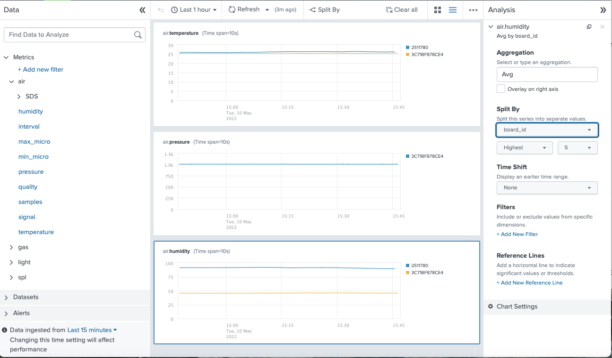

# MQTT Async code

Pushes IOT measurements published on **MQTT** to Splunk metrics index through **HTTP Event Collector** or **HEC**.

## Publish to MQTT

The IoT device sends its measurements to MQTT topics having the following structure

- <RootTopic>/<thingId>/<sensorId>/<metricName>

As an example, a board having a MAC address of 00:25:96:FF:FE:12:34:56 fitted with a temperature sensor on port 3 might publish a temperature of 21.3 °C to a topic having the following name:

- Things/board-002596FFFE123456/dht11-3/air.temperature

The payload of this topic will be the actual temperature in floating notation: 21.3

The same sensor will publish the humidity to:

- Things/board-002596FFFE123456/dht11-3/air.humidity

And the finally the pressure will be published here:

- Things/board-002596FFFE123456/dht11-3/air.pressure

## Read in Splunk

Splunk can then handle these as separate metrics and process them:



## Local Setup

```bash
# Create virtual environment
python3 -m venv .venv
# Select Interpreter in VS Code
# Activate it
source .venv/bin/activate
python -> python3 -> /opt/homebrew/Cellar/python@3.9/3.9.12/Frameworks/Python.framework/Versions/3.9/bin/python3.9
# make sure pip is up to date
pip install --upgrade pip
# install project's requirements
pip install -r requirements.txt

```

## Splunk References

See the Splunk documentation on [Getting metrics from other sources](https://docs.splunk.com/Documentation/Splunk/latest/Metrics/GetMetricsInOther).

And [Python code examples](https://www.splunk.com/en_us/blog/customers/http-event-collect-a-python-class.html)] from Splunk Blogs.
